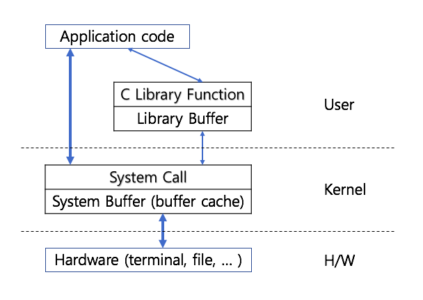

# 1. Linux file system
## 1.1 file system
##### 특징
- 트리구조
- 아스키 파일과 이진 파일을 동등하게 취급한다.
- 모든 파일은 허가모드를 갖는다. 

##### 구조
- partition들로 구성

	- super block : 파일 시스템 크기, 파일 시스템 내 자유 블록의 리스트 등
	- i-node list : 각 항은 하나의 파일과 대응

## 1.2 standard I/O libary
- 2개의 권한
	- user mode : 일반적 application 실행권한
	- kernel mode : system function

- 시스템 콜 호출
	- 직접적으로 system call을 호출
	- c library function을 이용하여 system call 호출
	-> buffering 정책 : 시스템콜에 대한 호출빈도가 줄어서 user모드와 kernel모드 전환 비용이 줄어든다
    - buffering 정책
    	1) 라인버퍼링 : 엔터를 입력받을 때까지 ex> stdout
        2) 풀버퍼링 : 버퍼가 가득찰 때 까지 ex> 일반파일
        3) 노버퍼링 : 버퍼링 없음 ex> stderr
- 표준 파일 입출력
	- fopen : 파일을 read 모드로 연다
 	- fgetc : 파일에서 1byte를 읽는다
	- fputc : 1byte를 표준출력으로 보낸다
	- fclose : 파일을 닫고 메모리 자원 해제
	```
    #include <stdio.h>
    int main (int argc, char **argv)
    {
    	FILE *fp;
        int ch;  // 반드시 int로 선언해야함, 안그러면 파일 사이즈를 넘을수도 있음
        int count = 0;
        fp = fopen(argv[1], "r");
        
        while( (ch = fgetc(fp))!= EOF)
        	count++;
        
        printf("count=%d\n", count);
        
        fclose(fp);
        return 0;
    }
    ```
    - 입출력 함수 
    	- fgetc, fputc, : byte단위
    	- fgets, fputs : 라인 단위 처리 가능
    	- fread, fwrite : 버퍼 단위 처리 가능